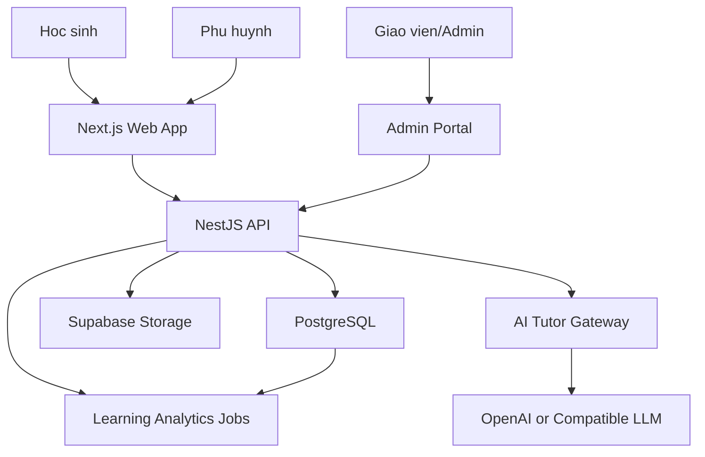
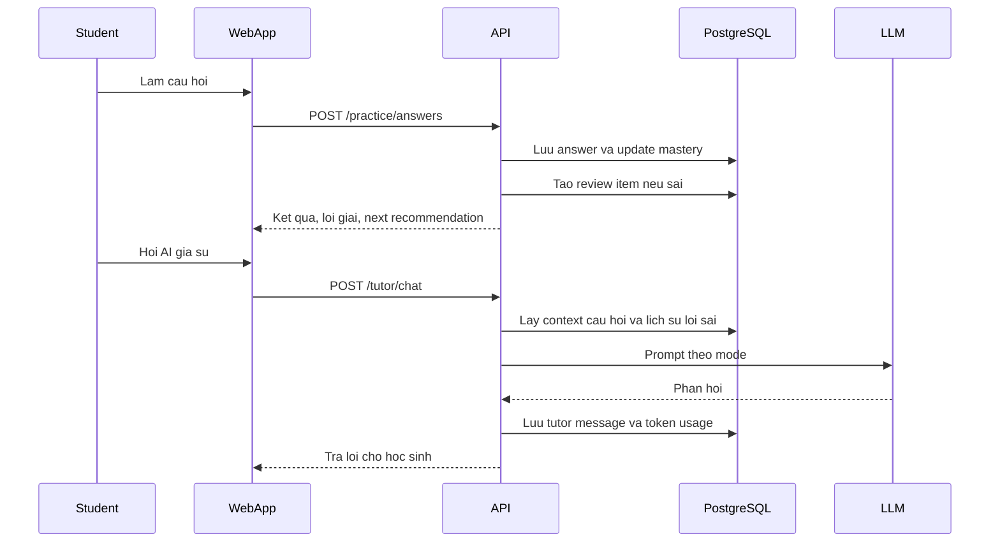

# System Architecture

## Kien Truc Tong The

## Thanh Phan

- Frontend: Next.js App Router, TypeScript, Tailwind CSS, shadcn/ui hoac component system noi bo.
- Backend: NestJS modules theo domain: Auth, Content, QuestionBank, Practice, Exam, Analytics, Tutor, StudyPlan, Gamification.
- Database: PostgreSQL, Prisma hoac Drizzle ORM.
- Auth: Supabase Auth hoac Auth.js voi Google va email magic link.
- AI: AI gateway rieng de quan ly prompt, mode, moderation, logging va chi phi.
- Hosting: Vercel cho frontend, Railway/Fly.io/Supabase Edge/Render cho API, Supabase Postgres.

## Data Flow Hoc Tap

## AI Safety

- Tat ca prompt co `mode`: teacher, practice, exam.
- Che do thi that khong tra loi noi dung cau hoi, chi nhac quy che va thoi gian.
- AI khong khang dinh diem thi that chinh xac, chi du doan khoang diem voi do tin cay.
- Chua bai Van phai tra ve rubric, loi cu the va goi y sua; khong viet lai toan bo bai thay hoc sinh neu dang o che do luyen viet.
- Log prompt/response an danh de kiem soat chat luong.

## Analytics

- Event tracking: lesson_started, question_answered, exam_submitted, tutor_used, review_completed.
- Batch jobs tinh mastery theo topic, streak, XP, predicted_score.
- Dashboard doc tu bang tong hop `student_topic_mastery` va `student_daily_metrics` de tranh query nang.

## Khuyen Nghi Trien Khai

- Bat dau bang mon Toan + Anh vi cham diem tu dong ro rang; them Van AI grading trong sprint rieng.
- Tach content seed va official content. De chinh thuc chi luu metadata/link neu chua co quyen su dung.
- Dung feature flags cho AI generated exam de kiem duyet truoc khi mo rong.
