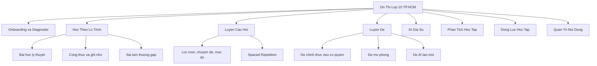

# Feature Map

## So Do Chuc Nang

## Hoc Theo Chuyen De

- Toan: can bac hai, bieu thuc, ham so, do thi, phuong trinh, he phuong trinh, bat phuong trinh, xac suat-thong ke, hinh hoc phang, hinh khong gian, toan thuc te, van dung cao.
- Ngu van: doc hieu van ban van hoc, doc hieu van ban nghi luan/thong tin, nghi luan xa hoi, nghi luan van hoc, ky nang viet doan/bai.
- Tieng Anh: ngu am, trong am, tu vung, ngu phap, giao tiep, word forms, sentence transformation, cloze test, reading comprehension.

## Luyen Cau Hoi

- Bo loc theo mon, topic, muc do, nam, nguon, trang thai yeu thich/sai.
- Lam bai tung cau hoac theo bo 10/20/40 cau.
- Hien loi giai sau khi tra loi neu khong o che do thi.
- Neu sai: tao review item voi ngay on lai theo SM-2 don gian.

## Luyen De

- De mo phong theo ma tran TP.HCM.
- De chuyen de theo muc tieu ngan han.
- De AI tao moi nhung can trang thai `draft`, `reviewed`, `published`.
- Chuyen doi che do: practice, timed, exam.

## Dashboard

- Diem trung binh gan nhat theo mon.
- Ty le dung va toc do lam bai.
- Chuyen de manh/yeu.
- So cau da lam, thoi gian hoc, streak.
- Du doan khoang diem thi that va viec can lam tiep.

## Admin

- CRUD mon hoc, topic, lesson, question, exam template.
- Import JSONL/CSV.
- Review noi dung AI-generated.
- Xem thong ke cau hoi bi bao loi.
