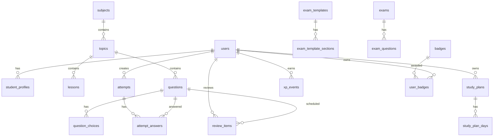

# Database Design

## Nguyen Tac

- Tach noi dung hoc tap khoi du lieu tien do ca nhan.
- Moi cau hoi co metadata day du de loc, tao de va phan tich.
- Luu attempt/answer dang event de truy vet tien bo.
- Spaced repetition la bang rieng de co the thay doi thuat toan.

## ERD Rut Gon

## Bang Chinh

### users

- `id uuid pk`
- `email text unique`
- `display_name text`
- `role enum(student,parent,teacher,admin)`
- `created_at timestamptz`

### student_profiles

- `id uuid pk`
- `user_id uuid fk users`
- `grade int default 9`
- `current_scores jsonb`
- `target_scores jsonb`
- `target_school text`
- `exam_date date`
- `daily_study_minutes int`

### subjects

- `id text pk`: `toan`, `ngu-van`, `tieng-anh`
- `name text`
- `exam_duration_minutes int`

### topics

- `id text pk`
- `subject_id text fk subjects`
- `name text`
- `exam_weight numeric`
- `parent_topic_id text null`
- `order_index int`

### lessons

- `id uuid pk`
- `topic_id text fk topics`
- `title text`
- `summary text`
- `theory_md text`
- `formulas jsonb`
- `examples jsonb`
- `common_mistakes jsonb`

### questions

- `id text pk`
- `subject_id text fk subjects`
- `topic_id text fk topics`
- `difficulty enum(NhanBiet,ThongHieu,VanDung,VanDungCao)`
- `source text`
- `source_year int null`
- `question_type text`
- `prompt_md text`
- `answer jsonb`
- `solution_md text`
- `tip_md text`
- `tags text[]`
- `estimated_time_seconds int`
- `status enum(draft,reviewed,published,archived)`

### question_choices

- `id uuid pk`
- `question_id text fk questions`
- `label text`
- `content_md text`
- `is_correct boolean`

### exams va exam_templates

- `exam_templates`: ma tran de thi theo mon/nam/kieu de.
- `exam_template_sections`: so cau, topic, muc do, diem, thoi gian.
- `exams`: de cu the da tao tu template.
- `exam_questions`: thu tu cau, diem, lien ket question.

### attempts va attempt_answers

- `attempts`: user, exam/practice set, started_at, submitted_at, score, mode.
- `attempt_answers`: question, answer_payload, is_correct, score, time_spent_seconds, feedback.

### review_items

- `user_id`, `question_id`, `ease_factor`, `interval_days`, `repetition_count`, `due_at`, `last_result`.
- Tao khi hoc sinh sai, danh dau kho, hoac AI phat hien lo hong.

### student_topic_mastery

- `user_id`, `topic_id`, `mastery_score 0..1`, `confidence`, `last_practiced_at`, `weakness_reason`.

## Chi Muc Nen Co

- `questions(subject_id, topic_id, difficulty, status)`.
- `attempt_answers(user_id, question_id, created_at)` thong qua join attempt hoac denormalized.
- `review_items(user_id, due_at)`.
- `student_topic_mastery(user_id, mastery_score)`.
