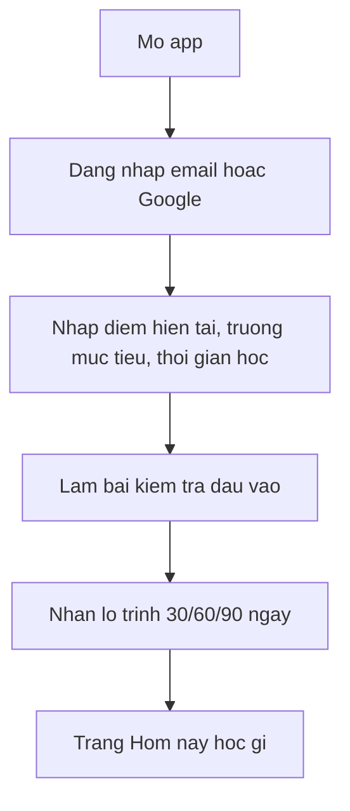

# User Flows

## Onboarding Hoc Sinh

## Hoc Theo Lo Trinh

1. Hoc sinh vao dashboard.
2. He thong hien 3 viec uu tien hom nay: hoc ly thuyet, luyen cau, on cau sai.
3. Hoc sinh chon bai hoc, xem tom tat, cong thuc, vi du.
4. Lam cau luyen tap theo muc do tang dan.
5. He thong cap nhat mastery, XP va lich on lai.

## Luyen Cau Sai

1. Vao `Can on lai`.
2. He thong lay review item den han.
3. Hoc sinh tra loi.
4. Neu dung nhanh: tang interval.
5. Neu sai: giam interval, hien loi giai, de xuat bai hoc lien quan.

## Thi Thu

1. Chon mon va dang de.
2. He thong tao de theo template TP.HCM.
3. Bat dau dem nguoc; AI bi khoa o che do `Thi that`.
4. Nop bai; cham tu dong phan trac nghiem/ngan.
5. Van tu luan chuyen sang AI grading + co co che giao vien review sau.
6. Tra ve bang diem, cau sai, topic yeu, de xuat buoi hoc tiep theo.

## Chua Bai Van

1. Hoc sinh nhap bai viet hoac upload text.
2. Chon loai bai: doan 200 chu, nghi luan xa hoi, cam nhan van hoc.
3. AI cham theo rubric, chi loi dien dat, lap luan, dan chung.
4. He thong yeu cau hoc sinh sua 1-2 doan quan trong thay vi viet lai toan bai.

## Phu Huynh

- Xem tien do tuan, streak, thoi gian hoc, diem thi thu.
- Xem canh bao: bo hoc, giam diem, luyen qua it.
- Khong xem chi tiet chat rieng tu neu khong duoc hoc sinh/nhan chinh sach cho phep.

## Admin/Giao Vien

- Import cau hoi JSONL.
- Kiem duyet cau AI-generated.
- Tao exam template.
- Xem cau hoi bi bao sai va sua loi giai.
