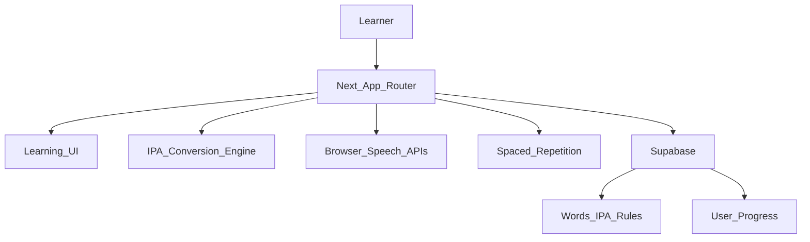

# Architecture

## Layers

- `src/app`: route-level composition.
- `src/components`: reusable UI and learning widgets.
- `src/data`: local seed content for the MVP.
- `src/lib/ipa`: deterministic IPA conversion and visualizer tokens.
- `src/lib/srs`: SM-2 and Leitner scheduling.
- `src/hooks`: browser speech synthesis, recording, and recognition.
- `src/lib/supabase`: Supabase clients and database types.
- `supabase`: SQL schema, RLS policies, and seed data.

## Data Flow

1. A learner opens a word page.
2. The word data provides English, IPA, Vietnamese hint, meaning, examples, and optional audio URL.
3. The IPA engine tokenizes the IPA and emits token-level Vietnamese mappings.
4. Browser audio reads the English word slowly or naturally.
5. Recording and speech recognition provide MVP feedback.
6. Game and review results can be persisted to Supabase behind RLS.

## Security

- Learning content is public read-only.
- User-owned rows are protected by `auth.uid()` RLS policies.
- Service role keys must remain server-only.
- Browser speech APIs process audio locally in the user agent unless browser speech recognition delegates to the browser vendor.
