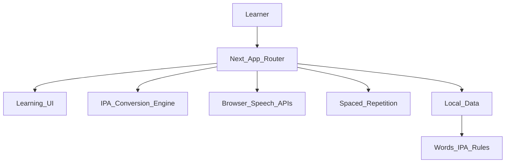

# Architecture

## Layers

- `src/app`: route-level composition.
- `src/components`: reusable UI and learning widgets.
- `src/data`: local seed content for the MVP.
- `src/lib/ipa`: deterministic IPA conversion and visualizer tokens.
- `src/lib/srs`: SM-2 and Leitner scheduling.
- `src/hooks`: browser speech synthesis, recording, and recognition.

## Data Flow

1. A learner opens a word page.
2. The word data provides English, IPA, Vietnamese hint, meaning, examples, and optional audio URL.
3. The IPA engine tokenizes the IPA and emits token-level Vietnamese mappings.
4. Browser audio reads the English word slowly or naturally.
5. Recording and speech recognition provide MVP feedback.
6. Game and review state stays in the browser session for the static MVP.

## Security

- Learning content is bundled as public static frontend data.
- The static MVP does not use backend credentials or server-side secrets.
- Browser speech APIs process audio locally in the user agent unless browser speech recognition delegates to the browser vendor.
